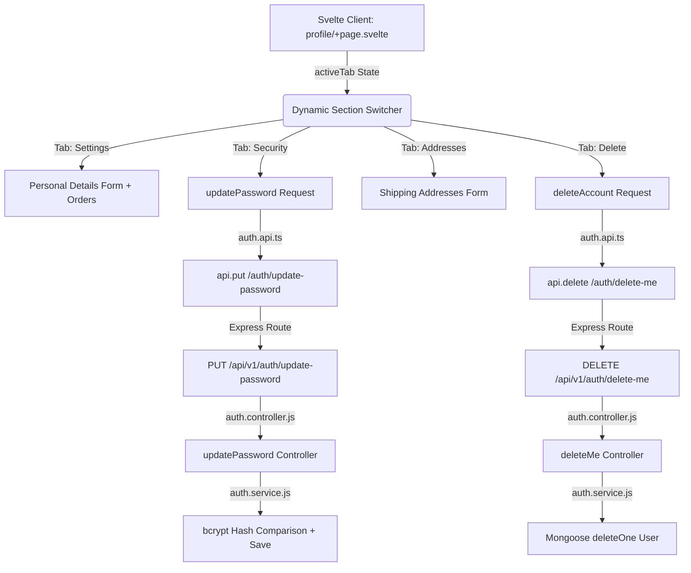

# 🌟 Opsi 2: Dynamic Tabbed Profile Layout & Full Security Features

A premium, interactive makeover for the user `/profile` page, introducing clean tabs, secure credential management, and absolute user deletion control.

---

## 🛠️ Key Enhancements Implemented

### 1. 📂 Responsive & Interactive Tab System
*   Replaced the vertical scrolling monolithic layout on `/profile` with a beautiful **four-tab dynamic switch system**:
    *   **Account Settings**: Form to update personal details (First Name, Last Name, Email) and recent order history table.
    *   **Security & Password**: Forms to securely update password with input validation.
    *   **Shipping Addresses**: Form and card list to manage delivery addresses.
    *   **Delete Account**: A warning console for account deactivation.
*   The tab sidebar features smooth CSS active transitions, changing colors dynamically based on active selection with a clean shadow.

### 2. 🔐 Secure Password Changes
*   Integrated the frontend forms with the `updateUserPassword` service backend.
*   Includes client-side verification to ensure:
    *   New passwords match the confirmation password.
    *   New passwords meet length standards (minimum 8 characters).
    *   Displays real-time notification alerts (success/error states) with professional typography.

### 3. 🚨 Double-Safe Account Deletion
*   Created backend endpoint `DELETE /api/v1/auth/delete-me` mapped to the controller and the DB service.
*   Frontend features a warning console highlighting irreversible data losses (Addresses, Wishlists, Purchase History).
*   Enforces a text confirmation system requiring the user to type exactly **`DELETE`** before activating the red button.
*   Once confirmed, deletes the document from MongoDB, clears cookies/local-storage tokens automatically, and redirects the user safely to the homepage.

---

## 🧬 Code Architecture Mapping



---

## 🚀 Ready for Commit

Proposed commit message for this final stage of changes:
```bash
git add .
git commit -m "feat(profile): implement dynamic tab navigation, update password, and delete account flows"
```
